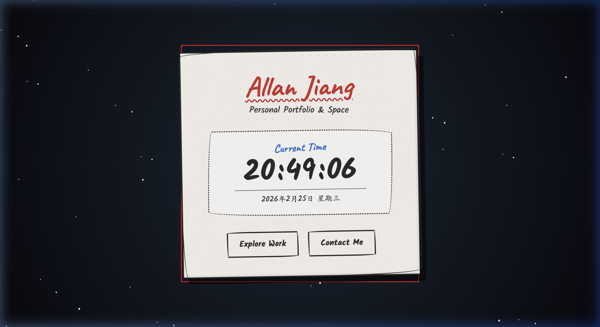

# Personal Portfolio & Dynamic Clock 🕒

<a href="https://jjys.github.io/deepReinforceLearningHW1/" target="_blank">➡️ **查看 Demo 網站 (Live Demo)**</a>

這是一個結合了「手繪塗鴉質感」與「動態宇宙星空背景」的個人介紹網頁，中央包含了一個能夠即時動態更新「時、分、秒」的時鐘面板。

  

## 🌟 特色功能 (Features)

* **動態時鐘**: 實時顯示目前的時、分、秒，並且會顯示當天的完整日期，每秒自動更新。
* **手繪塗鴉風格**: 使用了手寫字體 (Caveat & Kalam) 以及不規則的邊框、微傾斜的角度和紙張網格紋理，營造出手繪草圖的趣味質感。
* **宇宙星空背景**: 透過 CSS 動畫實作多層次的立體星星漂浮效果，與前方溫暖的米色紙紋手繪框產生強烈且特別的對比視覺。
* **響應式佈局 (RWD)**: 在不同尺寸的螢幕上（例如手機、平板或電腦）皆能自動調整字體與版面大小，保持良好的閱讀與互動體驗。

## 🛠️ 開發技術 (Tech Stack)

* **HTML5**: 負責網頁的結構與內容。
* **CSS3**: 負責所有視覺設計，包含星空動畫 (`@keyframes`)、多重陰影技巧 (`box-shadow` 產生星星)、不規則圓角 (`border-radius`) 等純手刻的手繪特效。
* **JavaScript (ES6+)**: 負責取得當前時間、自動補齊兩位數，並使用 `setInterval` 達成即時更新時間的功能。

## 🚀 如何使用 (How to run)

由於這是一個純前端 (Vanilla HTML/CSS/JS) 的專案，您不需要安裝任何套件或伺服器，只需兩步：

1. 將專案下載 (Clone) 到您的本地端電腦。
2. 可以直接雙擊點開 `index.html` 檔案，您的瀏覽器便會呈現完整的畫面與時鐘效果。

## 🌐 部署 (Deployment)

此專案已部署於 GitHub Pages，您可以隨時點選上方的 Live Demo 查看最新版本。若您自行 Fork 此專案：

1. 請至您的 GitHub Repository 頁面。
2. 點擊 `Settings`。
3. 點擊左側 `Pages`。
4. 在 `Source` 下方選擇 `Deploy from a branch`。
5. Branch 選擇 `main`，並點擊 `Save`。

## 👨‍💻 作者

* **Allan Jiang**
